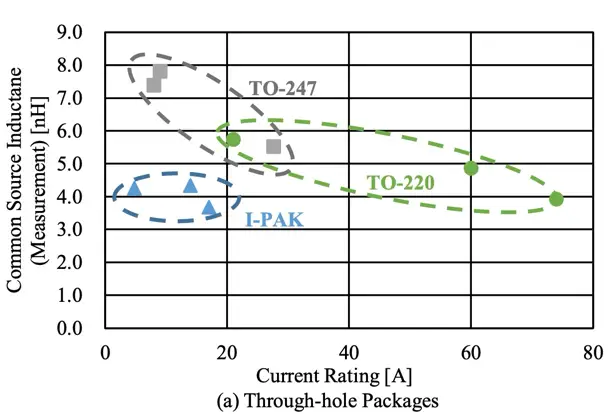

# EMI

EMI caused mainly by:

- parasitic inductance of shoot-through path (Cin-HS-LS)
- poor input capacitors
- fast switching
- high Qrr of LS mosfet

# Parasitics

# Kicad Plugin Parasitics

- 10 nH/cm

* STP110N8F6_V2:  Ldrain= 1nH ,Lsource=2nH and Lgate=2.5nH

IRFS4228PBF datasheet with D & S inductances:
4.5nH/7.5nH. notice that these might not simply add up

*

https://www.analog-praxis.de/abschaetzung-der-induktivitaet-von-leiterbahnen-a-535549/

https://artist-3d.com/how-to-calculate-the-inductance-of-pcb-trace/
https://resources.altium.com/p/pcb-trace-inductance-and-width-how-wide-too-wide
https://resources.system-analysis.cadence.com/blog/msa2021-is-there-a-pcb-trace-inductance-rule-of-thumb

# Tools

https://saturnpcb.com/saturn-pcb-toolkit/
https://saturnpcb.com/thank-your-pcb-toolkit/

bypass caps

voltage signal traces

- vulnerable to L coupling
- place a resistor at the end

current signal traces

- vulnerable to C coupling
-

Layout Guidelines

- "To avoid large negative transients on the switch node VSSA (HS) pin, the parasitic inductances between the
  source of the top transistor and the source of the bottom transistor must be minimized." (UCC21330x)

# Snubber

https://fscdn.rohm.com/en/products/databook/applinote/discrete/sic/mosfet/sic-mos_snubber_circuit_design_an-e.pdf

## Toshiba: [RC Snubbers for Step-Down Converters](https://toshiba.semicon-storage.com/info/application_note_en_20180901_AKX00078.pdf?did=63595)

* RC-Snubber design for buck DC-DC converters
* Snubber simulation
* Calculate parasitic inductance
* Impedance matching

https://www.cc.okayama-u.ac.jp/~eng_epc/pdf/IFEEC2017_Aikawa.pdf
TO-220: 4nH common source inductance

# Snubber

* C0G caps are more temperature stable than X7R.
* Resistor should handle 2W power

